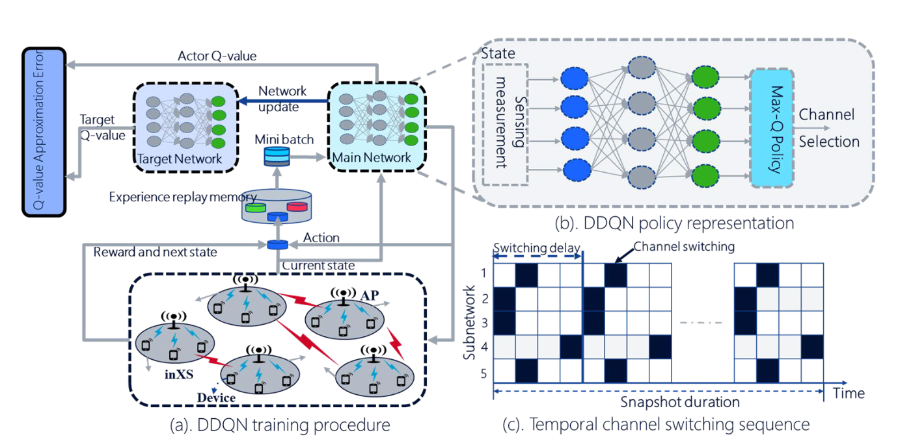

Conduct a brief inspection of the implementation and answer the following questions:

**I. What is the architecture of the DQN implemented? – Number of layers, number of neurons per layer, activation function, etc?**

    featureInputLayer input size obsInfo.Dimension(1)
    fullyConnectedLayer Neurons 24
    reluLayer
    fullyConnectedLayer 24 neurons 
    reluLayer
    fullyConnectedLayer length(actInfo.Elements) Neurons

**II. What role do the policy network and critic network play in the training of the DQN**

The critic network approximates the Q-value for all a given the current state Which is then fed through a policy, determining which action is the best. In this the policy is maxQ, which simply chooses the action resulting in the highest Q value.

    policy = rlMaxQPolicy(critic);

**III. What is the role of the parameter, epsilon? Is the value of epsilon constant during the training?**

It descripes the relationship between explorration and explotation

    epsilon = max(epsilon*(1-epsilonDecay),...epsilonMin);
    epsilonMin = 0.001;
    epsilonDecay = 0.0001;

IV. Run the training script with 𝑁𝑁 = 10 subnetworks and 𝐾𝐾 = 3 channels, and plot the training curve.

V. Determine:
- I. The number of training episodes to convergence
- II. The reward value achieved by the agent at convergence
- VI. Investigate how the DQN can be modified to solve a related but distinct problem involving power control where the power levels lie in the continuous range from 𝑃𝑃min to 𝑃𝑃max .