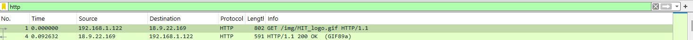
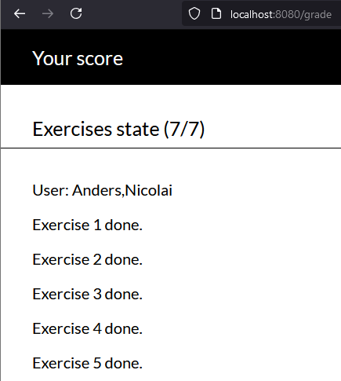

## This is the property of the Authors, we gladly accept donations in the form of beer.
- Authors: Anders Bundgaard and Nicolai Lyholm  
- Date: 14/10/2024                                                                              

# Task 1. 
### Outline differences between circuit-switching and packet-switching.
* **Connection establishment**
    - Circuitswitching: A logical connection is required between transmitter and receiver, this communication path is established before data transmission and remains active for the duration of communication. (Other devices cannot use the same communication path)
    - Packet-switching: There is no dedicated communication path, large chunks of data is packetized and each packet is routed through the network independently. The data packets are then organized at the receiver and the original data is reconstructed.

* **Data transmission**
    - Circuit-switching: Data is transmitted continously along the pre-determined path ensuring sequential delivery.
    - Packet-switching: Data is packetized and the arrival of packets happen independently with no strict order. The original data is then reassembled at the receiver.

* **Reliablity**
    - The reliablity of circuit-switching is higher as the resource is reservered to you. An example is a phone call is better quality than a messenger call, since the communication path is reserved for the duration of the phone call.   

# Task 2. 
### What is a counting process? Which distribution is used to model the counting process? 
A Counting process is a stochastic process $N(t)$ which takes non-negative integer values and is non-decreasing, that is:
* $N(t)\geq 0$
* $N(t)$ is an integer
* if $s\leq t$ then $N(s)\leq N(t)$

Counting processes deal with the number of occurrences or events over time $t$. For example in queuing theory, the number of arriving jobs to a queue. Typically modelled using a poisson/exponential distribution due to its nice properties when modelling something over time (memoryless).

# Task 3.
### What are basic HTTP requests?
The Basic HTTP request are:
- **GET**: retrieve some data from the server
- **POST**: send some data to the server
- **HEAD**: only get the metadata from the server
- **OPTIONS**: request to know the server functionalities

# Task 4.
### Analyze the HTTP trace. You can use “Wireshark”.
- **Get the HTTP trace: https://kevincurran.org/com320/labs/wireshark/trace-http.pcap** 
    - Done  
- **Filter the HTTP traffic.**
    - Done 
- **Find an HTTP request (basically, get the first GET packet and expand its block). Write the source and destination IP.**
    - SRC: 192.168.1.122:64123
    - DST: 18.9.22.169:80

- **Show the headers and comment on what they mean. (e.g., “Host”: this is a mandatory header that identifies the name and port of the server)**
    - **HTTP Request**: *GET /img/MIT_logo.gif*, with *Get* being the HTTP method used, */img/MIT_logo.gif* being the URI. 
    - **Host**: *www.mit.edu*, is the domain or ip address on which the resource is hosted.
    - **Connection**: *keep-alive*, indicates whether the connection should be kept-alive for further requests or closed.
    - **Cache-control**: *max-age=0*, indicates whether the client is requesting a fresh copy of the resource or a cached version can be served.
    - **User-agent**: *Macintosh/5.0, AppleWebKit Chrome/Safari*, Contains information about the client software and browser.

- **Show response to the first GET in the trace; expand the block. Report “Status Code” and “Status Code Description”.**
  - **Status code**: 200
  - **Status code description**: Ok

- **Can you verify if the server needs to send fresh content for the second GET request? (Hint: check the third and fourth HTTP trace; check the “if-modified-since” header.)**
  - **Status code**: 304
  - **Status code description**: Not modified
  it does not need to send new content. 
# Task 5.
 **Download the exercise program from https://luca31.github.io/HTTP-requests-exercises/ and post the code and results obtained in the report.Print the POST requests and the relative responses in full, including the URL, body, and headers. What request code numbers do the actual packets use?**
 
If you get an “unhandled error event” when you start the server, open index.js and comment the three lines after the comment “copy to clipboard,” i.e., lines 101-103 in the file. The server should work then.

[The code and results](T1_Application_layer_ex5.html)