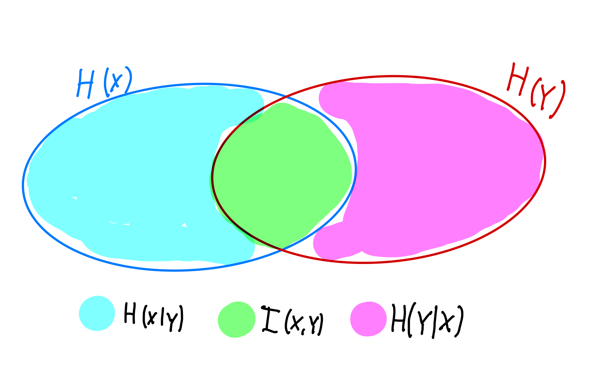

# T2. Performance and Reliability Analysis of Communication Networks
## This is the property of the Authors, we gladly accept donations in the form of beer.
- Authors: Anders Bundgaard and Nicolai Lyholm  
- Date: 14/10/2024  
## Task 1. 
### Define entropy H(X) and provide its interpretation.
The entropy of a random variable describes its uncertainty or the amount of information encoded in this random variable/process. The more information we know in advance (less uncertain about the outcome), the lower the entropy.
$$H(x)=\sum_{x\in X} p(x)log\left(\dfrac{1}{p(x)}\right)\\
H(x)=\sum_{x\in X} -p(x)log(p(x)),$$
Where $x$ is a random variable in the set $X$ and is distributed according to $p:X\rightarrow[0,1]$. In communication systems we typically use a log base of 2, since we are describing bits, however any base is applicable depening on the context.

# Task 2.
### Consider a fair die and X a discrete random variable taking values from the set $X := {1, 2, 3, 4, 5, 6}$ in each role. 
#### (i) Calculate its entropy.
Since the die is fair each outcome is independent and the entropy can be expressed as:
$$H(x)=6 \cdot \frac{1}{6}log(6) = log(6) = 0.778$$ 
#### (ii) Can you generalize the entropy H(X) for M equally-probable outcomes?
$$H(x)=\sum_{x\in X} -p(x)log(p(x)) => H(x)= M \cdot \frac{1}{M} log(M) $$

# Task 3.
## Derive an expression for H(X,Y) following the definition of H(X).
This is trivial, as we use the definision. 

$$ H(X,Y)=\sum_{x,y} p(x,y)log\left(\dfrac{1}{p(x,y)}\right)\\$$

# Task 4. 
## Chain Rule for Entropy. Show that the entropy of two random variables is H(X,Y) = H(X) + H(Y|X)
$$ H(X,Y)=\sum_{x,y} p(x,y)log\left(\dfrac{1}{p(x,y)}\right)\\$$
the entropy of one plus the conditional entropy of the other:
Writing the joint probalilyty in the log as a conditional probability.  
$$H(X,Y)=\sum_{x,y} p(x,y)log\left(\dfrac{1}{p(x)p(y|x)}\right)\\$$
Using log manipulations:  $log (A\cdot B) = log(A)+log(B)$\\
$$H(X,Y)=\sum_{x,y} p(x,y)\left(log\left(\dfrac{1}{p(x)}\right)+log\left(\frac{1}{p(y|x)}\right)\right)\\
H(X,Y)=\sum_{x,y}\left( p(x,y)log\left(\dfrac{1}{p(x)}\right)\right)+\sum_{x,y} \left(p(x,y)log\left(\frac{1}{p(y|x)}\right)\right)\\$$
**Simplifying the first term**
$$\sum_{x,y}\left( p(x,y)\left(log\dfrac{1}{p(x)}\right)\right) = \sum_{x}p(x)log\left(\dfrac{1}{p(x)}\right)\sum_{y}p(y|x)$$
The sum over y is just the total probability which is 1, and it simplifies to:
$$\sum_{x}p(x)log\left(\dfrac{1}{p(x)}\right) $$
which is the marginal entropy of x:
$$H(x)= \sum_{x}p(x)log\left(\dfrac{1}{p(x)}\right)$$
**Simplifying the second term**
$$\sum_{x,y} p(x,y)\left(log\left(\frac{1}{p(y|x)}\right)\right) $$
Writing the joint probability as a conditional probability and grouping x and y dependent terms:
$$\sum_{x} p(x)\cdot \sum_{y}p(x,y)\left(log\left(\frac{1}{p(y|x)}\right)\right)  $$
This is the conditional entropy $H(y|x)$:
$$ H(y|x) = \sum_{x} p(x)\cdot \sum_{y}p(x,y)\left(log\left(\frac{1}{p(y|x)}\right)\right) $$ 

**Combining the two terms**
$$H(X,Y) = H(x)+ H(y|x) $$

This shows the joint uncertainty of $x,y$ can be expressed as the marginal uncertainty of $x$ plus the conditional uncertainty of $y$ once $x$ is known.

# Task 5. 
## Show H(X) - H(X|Y) = H(Y) - H(Y|X) = I(X;Y), where I(X;Y) is known as Mutual Information. Provide your interpretation of mutual information.
The mutual information denotes how much information can be gathered of $X$ by observing $Y$ and vice-versa. It is a measure of how dependent two random variables are. The mutual information is depicted by a Venn-diagram below.
