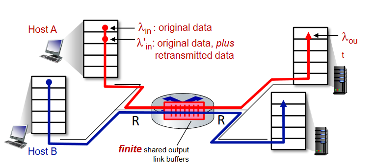

# T4. Performance and Reliability Analysis of Communication Networks

## This is the property of the Authors, we gladly accept donations in the form of beer.

- Authors: Anders Bundgaard and Nicolai Lyholm  
- Date: 

## Task 1. What is congestion? Discuss ways to control congestion

*"Too many sources sending too much data too fast for the network to handle"* [Kurose, Ross]

Congestion differs from the notion of flow control in that we are now dealing with multiple users sharing a medium rather than just one transmitter overwhelming the receiver with a too fast transmission rate. Congestion can occur whenever devices have to share a medium with limited capacity. Typically congesion occurs due to a bottleneck (typically a router), which has a limited buffer size and can only process packets at a given capacity. Consequences of congestion include:

* Long delays (queueing in router waiting to be serviced)
* Packet loss (buffer overflow at routers)

Congestion occurs if the incoming packet rate exceeds the outgoing rate, that is $\lambda_{in}>\lambda_{out}$ or if considering retransmissions $\lambda_{in}'>\lambda_{out}$. Several strategies and parameters can be tweaked to control congestion without relying on TCP specific mechanisms like TCP Reno or Tahoe.

* **Increase capacity** - Naturally a way to avoid congestion is to just invest in more capacity or bandwidth. Meaning the network can handle more incoming packets quicker. Of course this is both expensive and not always a feasible solution.
* **Traffic shaping** - Intelligently scheduling transmissions such that non-urgent data is transmitted during off-peak times can help alleviate congestion, typically a network will experience more traffic during cetrain times of day, if the load can be distributed more evenly this can alleviate the congestion.
* **Perfect knowledge** - If users have perfect knowledge of the network, that means current buffer conditions, capacity and knowledge of all users on the network, the transmissions can simply be scheduled in a way which avoids transmitting while the buffer is full thereby not needing any retransmissions and reducing congestion.
* **Optimal routing** - In a network consisting of multiple routers functioning in a packet switched manner, congesion can often occur if many users are routed through the same router causing a bottleneck. Therefore routing in such a way, which utilizes the capacity of all routers will minimize congestion.

## Task 2. What is the bandwidth-delay product? Explain its relation with congestion.

The bandwidth-delay product (BDP) is a key concept in networking, helping us understand the relationship between network capacity and inherent delay. The capacity or bandwidth of a network is typically denoted in bits per second [bps] and the delay is measured in the form of round-trip-time (RTT). The BDP is given as:
$$ \textrm{BDP} = BW\cdot RTT$$

The BDP represents the maximum amount of bits that can be in transit in the network at any given time. It represents the ideal transmission rate, which will fully utilize the network without causing congestion. If the transmitter exceeds the BDP buffers will start to fill up causing delays and potentially packet loss due to congestion.

## Task 3. Explain the AIMD approach of TCP. Discuss Slow Start, Collision Avoidance, and Fast Recovery phases.

*Additive Increase Multiplicative Decrease* (AIMD) is a core mechanism in TCP to manage congestion. It controls the rate at which data is sent by adjusting the congestion window according to the state of the network. Traditional AIMD in TCP consists of two phases:

- **Congestion Avoidance (Additive increase)** - The congestion window (CWND) increases by one Maximum Segment Size (MSS) each RTT. Meaning the CWND increases additively and linearly and TCP slowly approaches the network capacity. $\\W =W+1MSS$

- **Congestion Detection (Multiplicative decrease)** - Once a packet loss is detected TCP responds by reducing the CWDN by a factor, typically 0.5. This gives rise to a rapid multiplicative decrease of the CWND, allowing the network to recover from its potentially congested state.
$\\ W=\frac{W}{2}$

The Slow Start, Collision Avoidance and Fast Recovery phases, were introduced as an improvement on AIMD. These three phases function as follows:

- **Slow Start** - Replaces the additive increase phase with a more rapidly increasing CWND, thereby achiving better network utilization. Rather than increasing linearly by one MSS per RTT, the CWND increases exponentially, doubling each RTT. Until packet loss is detected.
  - Once packet loss is detected (due to timeout or 3-acks), a slow start threshold (SSThresh) is set to half the CWND which caused the packet loss. The CWND is either reset to 1 MSS or set to $\mathrm{SSThres} + 3$, depending on the TCP flavour (Tahoe or Reno).
- **Congestion avoidance** - If the CWND was reset to 1 MSS, the slow start phase begins again, but stops once SSThres is reached, after which Congesion Avoidance begins. In this phase the CWND goes from an exponential growth to a linear growth, thereby carefully approaching the network capacity (like the additive increase phase). Once packet loss is detected a new SSThres is set, CWND is reset and the cycle repeats.
- **Fast Recovery** - Fast recovery is a mechanism introduced in TCP Reno, which differentiates between packet losses caused by timeout and 3-acks. If the packet loss was caused by 3-acks the CWND is reduced to $\textrm{SSThres}+3$, rather than resetting to 1, which allows for better network utilization. Otherwise, if the packet loss was caused by timeout the CWND is simply reset to 1 MSS (like in TCP Tahoe).

## Task 4. Discuss TCP Reno and TC Tahoe

**TCP Tahoe** was the first version of Congestion Control in TCP implemented in 1988. It is a primitive congestion control which follows the Slow Start and Congestion Avoidance phases listed above. In TCP Tahoe, no distinction is made between packet loss due to timeout or 3-acks, the CWND is simply reset to 1 and SSThres is updated each time packet loss is detected. This leaves room for improvement, as the network utilization will be lower due to unnecessarily resetting the CWND and waiting for slow start.

**TCP Reno** was implemented in 1990 as an improvement to Tahoe, implementing the fast retransmit and fast recovery phase. Here packet losses due to timeout and 3-acks are treated differently. On timeout Reno behaves exactly like Tahoe, resets the CWND and begins slow start. On 3-Acks CWND is halved and fast recovery begins. Here $\textrm{SSThres} = \textrm{CWND}/2$ and $\textrm{CWND} = \textrm{SSThres}+3$. CWND increases on each DUPACK, meaning potentially lost data is retransmitted and finally the CWND is reset to SSThres once new data is received and acknowledged. TCP Reno is showcased on the figure above.

## Task 5. What are the signals to indicate congestion?

Common congestion indicators are:

- **Packet loss** - Indicates a packet failed to reach its destination, this is not necessarily due to congestion, but can be an indicator of buffer overflow at the routers, indicating too many packets are arriving and the link capacity is exceeded. Packet loss is used as a signal in TCP to indicate congestion, and TCP responds by lowering the congestion window and thereby the transmission rate.

- **RTT** - The RTT is the time taken for a packet to travel from the source to the destination and back again. Naturally this time may also be influenced by channel distortions, but it can serve as an indicator of congestion, as it may indicate long queue times at the router. This means buffers are filling up and packets are waiting to be serviced.

## Task 6. What is the fairness problem in TCP congestion control?

## Task 7. Provide an overview of BBR, AQM, and ECN options
